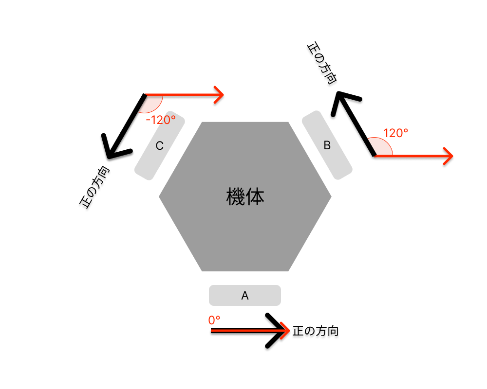

# プログラム解説

## 全体像

本プログラムの`main.cpp`内の`loop()`の実装は以下のようになっています。

図のように、本プログラムは`getInput()`からコントローラの入力`input`を受け取り、`inputOutput()`に引数として与えることで各モータへの出力を得ることを想定して作られています。

したがって、`inputToOutput()`の中身を適切に実装することでラジコンを動かすことができます。

## `inputToOutput()`の概要

### 引数`input`の概要

`inputToOutput()`の引数`input`の型は`Input`で、`Input`のメンバ変数は以下のような構成になっています。

| 変数名     | 説明                                         |
| ---------- | -------------------------------------------- |
| `x`        | コントローラの左スティックのx軸方向の値      |
| `y`        | コントローラの左スティックのy軸方向の値      |
| `circle`   | コントローラの〇ボタンが押されているかどうか |
| `square`   | コントローラの□ボタンが押されているかどうか  |
| `cross`    | コントローラの✕ボタンが押されているかどうか  |
| `triangle` | コントローラの△ボタンが押されているかどうか  |

それぞれのメンバ変数には`input.<メンバ変数名>`でアクセスできます。

### 返り値`output`の概要

`inputToOutput()`の返り値`output`の型は`Output`で、`Output`のメンバ変数は以下のような構成になっています。

| 変数名   | 説明                    |
| -------- | ----------------------- |
| `motorA` | モータAへの出力 (0~255) |
| `motorB` | モータBへの出力 (0~255) |
| `motorC` | モータCへの出力 (0~255) |

それぞれのメンバ変数には`output.<メンバ変数名>`でアクセスできます。

また、モータA, B, Cに繋がっている車輪の配置は以下のようになっています。

### `output`の計算ヒント

#### 並進(x, y方向)

x軸方向に機体を進めたいときには

図より「機体を進めたい量」にcosθをかけた値が「車輪の出力」になります。(※ $\theta$: 車輪の角度)

また、同様にy軸に機体を進めたいときには「機体を進めたい量」にsinθをかけた値が「車輪の出力」になります。

さらに、x軸, y軸それぞれへの「進めたい量」はベクトルとして足し合わせができます (**線形性**)。

つまり、「x軸方向にa, y軸方向にb進めたい」ときには、車輪への出力は

$$
a\cos\theta + b\sin\theta
$$

となります。

#### 旋回

全ての車輪を正方向に同じだけ回転させると反時計回りに旋回します。

逆に、全ての車輪を逆方向に同じだけ回転させると時計回りに旋回します。

また、旋回のための出力もまたx軸, y軸それぞれへの「進めたい量」との足し合わせが可能です。(**線形性**)

したがって、「x軸方向にa, y軸方向にb進めながらcだけ旋回させたい」ときには、車輪への出力は

$$
a\cos\theta + b\sin\theta + c
$$

となります。
